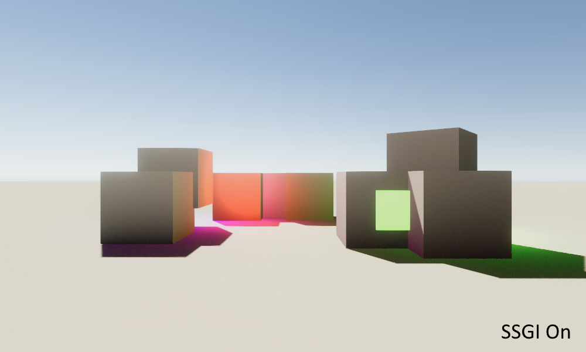
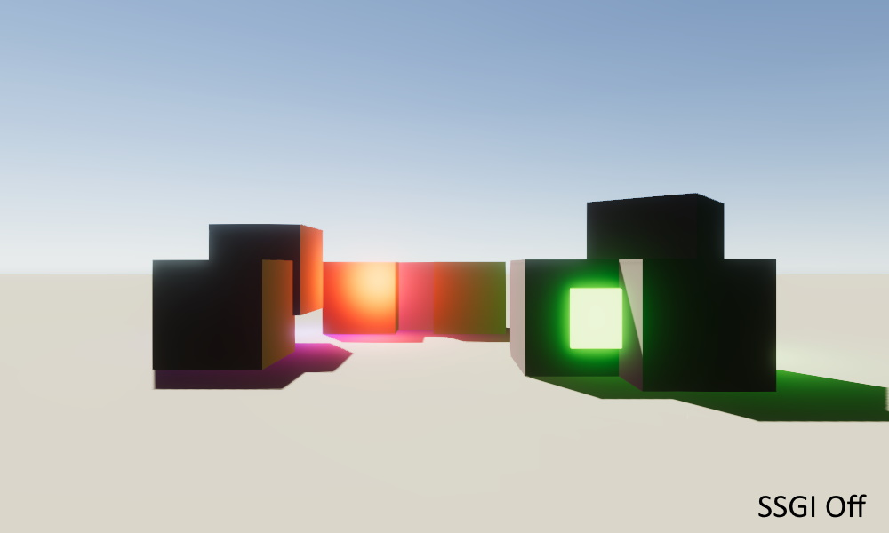

# SSGI-URP
Screen Space Global Illumination for Universal Render Pipeline. It's a port of a SSGI shader wrote by [Martins Upitis](https://github.com/martinsh/godot-SSGI) for the Godot Engine. It's adapted to work as a render feature for Unity's Universal Render Pipeline.

Keep in mind it's a simple implementation of SSGI and it's not perfect.
Performances are good if you keep noise and sample count low.

## Requirement
- Unity 2019.3+
- Universal Render Pipeline 7.2+
- **Depth Texture Enabled**
- Tested on Windows 10

SSGI Enabled

SSGI Disabled

## Setup
| Parameter | Role | 
|-----------|------|
| SamplesCount | How many samples to use. A value between 8 and 16 is fine for performances |
| IndirectAmount | Indirect GI Boost. No cost on performances |
| NoiseAmount | Add some noise to the final render, impact performances, keep it lower to 2 |
| Noise | Enable or not the noise |

## Usage
- Create or open a URP project
- Open the Package Manager window
- Add this repository as a package by clicking on the + icon
- Past `git@github.com:demonixis/SSGI-URP.git`
- Add a new SSGI Render Feature to your Renderer
- Use the SSGI material
- Have fun!

## License
This project is released under the MIT license, like [the original shader](https://github.com/martinsh/godot-SSGI).